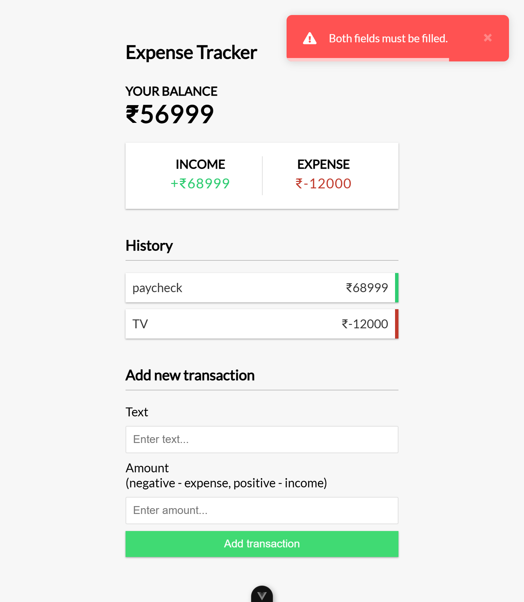

# Vue 3 Expense Tracker 💰📊

An **Expense Tracker App** built with **Vue 3** and the **Composition API**. Easily **add and remove expenses/income**, track your balance, and **save data** to local storage for persistence.  

🔗 **Reference Video**: [Watch Here](https://youtu.be/hNPwdOZ3qFU?list=LL)  

## 🚀 Features

✅ Add and remove income/expenses  
✅ Track total **balance, income, and expenses**  
✅ Save data to **local storage** for persistence  
✅ **Vue Toastification** for notifications  
✅ Built with `<script setup>` syntax (Vue 3.2+)  

## 📸 Screenshot

## 📦 Project Setup

### **1️⃣ Install dependencies**  
\`\`\`sh
npm install
\`\`\`

### **2️⃣ Compile & Start Development Server**  
\`\`\`sh
npm run dev
\`\`\`

### **3️⃣ Compile & Minify for Production**  
\`\`\`sh
npm run build
\`\`\`

## 📜 License
This project is licensed under the **MIT License**.  

